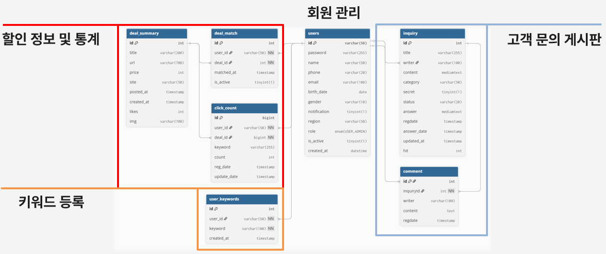
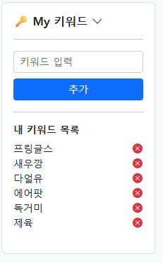
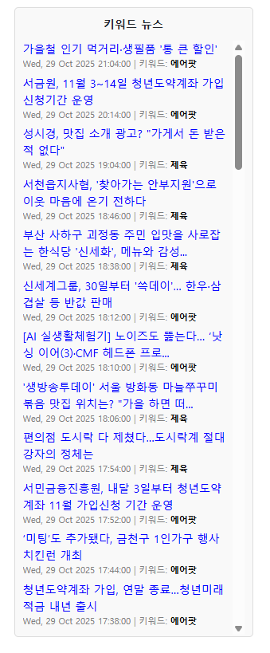
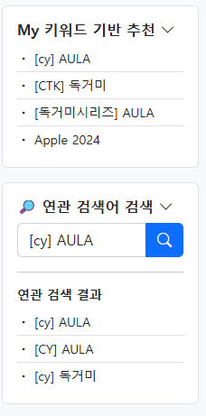
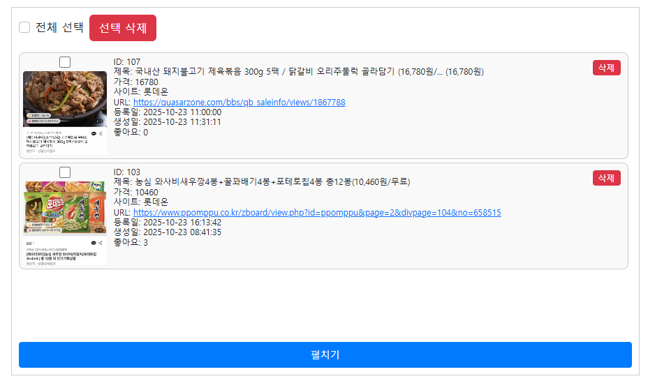
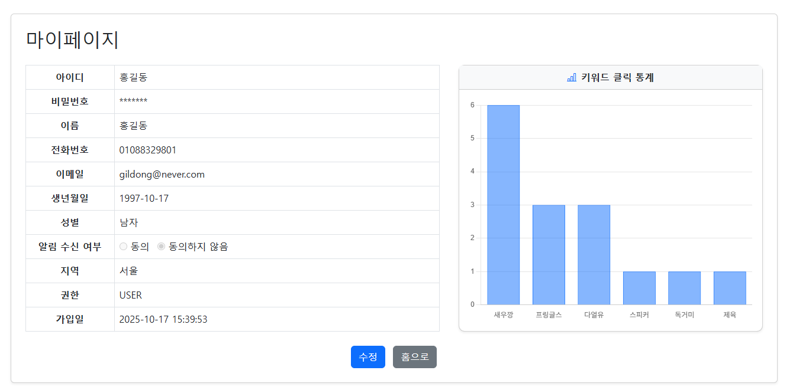
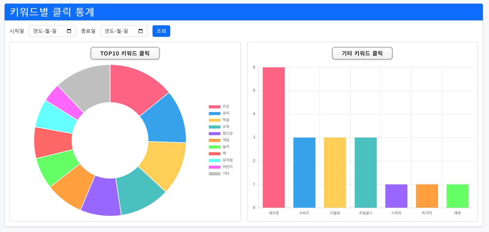
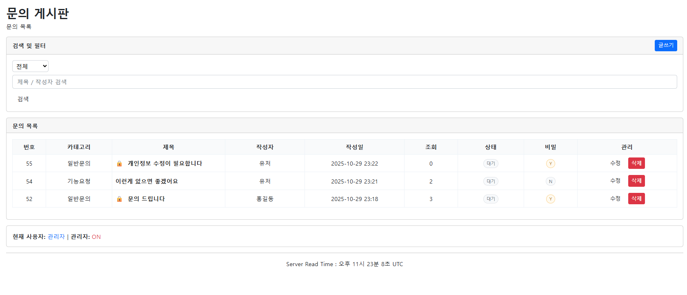

# Dealarm

실시간 할인정보 공유 플랫폼 **Dealarm** 은 사용자가 등록한 키워드를 바탕으로 외부 쇼핑/뉴스/커뮤니티 등에서 **할인·딜 정보를 수집**하고, **스케줄러**로 주기 실행된 **크롤러**가 데이터를 정제·중복제거 후 **알림(SMS)** 으로 전달합니다. 사용자의 클릭을 **추적·집계**하여 개인화 추천과 대시보드 통계를 제공합니다.

http://dealarm.ddns.net/

## 🧰 Tech Stack

- **Backend:** Java, Spring MVC, JSP, JSTL
- **Frontend:** JSP (JSTL), HTML/CSS/JS
- **Python:** Python (크롤러, SMS 연동)
- **DB:** MySQL (AWS RDS)
- **Infra/DevOps:** Tomcat (WAR 배포), AWS EC2, AWS RDS, 환경변수(.env) 연동, Scheduler (Spring)
- **External APIs:** Solapi(SMS), Naver 검색 API, Google Ads 키워드 API

## ✨ Features

- **회원관리**: 가입/로그인/권한/관리자 기능
- **키워드 등록**: 사용자별 관심 키워드 저장
- **키워드 기반 뉴스 추천**: 관심 키워드 포함된 기사 추천
- **관심 키워드 추천**: 유저 키워드 랭킹(DB) 및 연관어 검색기능(Google Ads API)
- **크롤링**: 외부 소스 수집, 제목 유사도 기반 중복 제거 알고리즘
- **스케줄러**: 정해진 주기마다 크롤러 실행, 오래된 DB데이터 및 임시 이미지 데이터 관리
- **알림(SMS)**: Solapi 연동 — 키워드 매칭 결과 전송
- **클릭 추적**: 링크 클릭 이벤트 수집 → 개인화/통계
- **대시보드**: 인기/개인화 지표 제공 (성별/연령 필터 등)
- **고객 문의 게시판**: 고객 문의사항을 접수하는 게시판

## 🔄 User & Data Flow

1. 사용자가 **키워드 등록**
2. **스케줄러**가 주기적으로 **크롤러** 실행 → 데이터 수집
3. **중복 제거 / 정제** 로 유의미한 딜만 저장
4. 사용자 **키워드-딜 매칭** → **SMS 발송**
5. 사용자가 링크 **클릭** → 서버에 **클릭 로그 축적**
6. 통계/개인화 점수 반영 → 다음 추천과 대시보드에 활용

## 🗄️ DATABASE

- **users** : 사용자 계정 정보와 권한, 활성 상태를 관리하는 기본 회원 테이블
- **user_keywords** : 사용자가 등록한 관심 키워드를 저장하는 테이블
- **deal_summary** : 크롤링된 할인 상품 정보를 저장하는 테이블
- **deal_match** : 사용자 키워드와 할인 상품 간 매칭 기록을 관리하는 테이블
- **click_count** : 사용자별 상품 클릭 기록과 횟수를 저장하는 테이블
- **inquiry** : 사용자 문의와 관리자기능을 담당하는 게시판 테이블
- **comment** : 문의글에 대한 댓글을 관리하는 테이블

## 🧭 User Guide (사용자 매뉴얼)

http://dealarm.ddns.net/

### 1️⃣ 회원가입 / 로그인
- 상단 메뉴에서 **[회원가입]** 버튼 클릭 후 필수 정보 입력
- 네이버 등 **SNS 로그인**도 지원
- 로그인 시 마이페이지, 키워드 관리, SMS 수신 설정 이용 가능


### 🔑 키워드 등록
- **마이페이지 → 관심 키워드 관리**에서 키워드 등록 가능  
- 입력된 키워드는 사용자별로 DB에 저장되고, 스케줄러가 정기적으로 검색  
- 등록된 키워드는 이후 뉴스 추천, SMS 알림, 통계 분석에 모두 활용됨  


### 📰 키워드 기반 뉴스 추천
- 등록한 키워드와 일치하거나 관련된 최신 기사를 자동으로 추천  
- **네이버 뉴스 검색 API**를 활용하여 실시간 기사 수집  


### 💡 관심 키워드 추천
- 다른 사용자들의 키워드 데이터(DB 기반)를 분석하여 인기 키워드 추천  
- **Google Ads API**를 통해 관련 검색어(연관 키워드) 자동 제안  
- 마이페이지 하단 또는 ‘추천 키워드’ 섹션에서 확인 가능  


### 🕸 크롤링
- 등록된 키워드를 기반으로 **외부 커뮤니티·쇼핑몰**에서 데이터 자동 수집  
- **Python 크롤러**(ppompu_crawler, quasar_crawler)가 실행되어 JSON으로 저장  
- 제목 유사도(문자열 비교 알고리즘)를 이용해 **중복 딜 제거**  

### ⏱ 스케줄러
- Spring Scheduler가 5분 간격(`fixedDelay = 300000`)으로 자동 실행  
- **CrawlScheduler.java**  
  - 크롤러 실행  
  - 오래된 DB 데이터 및 이미지 정리  
  - 오류 로그 관리  

### 📩 알림 (SMS)
- **Solapi SMS API**를 통해 매칭된 딜을 사용자에게 문자로 전송  
- `.env` 파일 내에 **API KEY / SECRET KEY** 설정 필요  
- 수신 동의한 사용자만 알림 수신 가능  


### 👆 클릭 추적
- 문자 또는 사이트 내 링크 클릭 시 **ClickController**에 이벤트 기록  
- 클릭 로그는 DB에 저장되어 개인화 점수 및 통계에 활용  
- 관리자 페이지에서 **클릭 통계 / 키워드별 클릭률**을 시각화  

### 📊 대시보드
- 성별, 연령대별 인기 키워드 및 클릭률 통계 제공  
- 사용자별 개인화된 맞춤 키워드 랭킹 표시  
- **관리자 페이지(admin_stats_home.jsp)** 에서 전체 통계 관리 가능  



### 💬 고객 문의 게시판
- 상단 메뉴의 **[고객 문의]** 클릭 후 게시글 작성 가능  
- 관리자는 문의사항에 대한 답변 등록 및 상태 관리 가능  
- **InquiryController** / **CommentController**에서 처리  


---

## ▶️ Run (Local)

1. **Java & Maven 설치** (또는 Gradle)  
2. **MySQL 준비**: 스키마 생성 및 `application.properties` / `.env` 에 DB 접속정보 설정  
3. (선택) **Python venv 설치** 후 크롤러/ SMS 모듈 의존성 설치  
4. `mvn clean package` 로 WAR 생성  
5. **Tomcat** `webapps/` 에 WAR 배치 → 서버 시작  
6. 환경변수/경로 확인: `.env`, 이미지/JSON 디렉토리 경로, 스케줄러 주기

## ☁️ Deploy (AWS)

- **EC2 (Ubuntu) + Tomcat**: `/opt/tomcat` 기준 배포
- **RDS(MySQL)** 보안그룹 및 계정 권한 구성
- `.env` → `/opt/tomcat/dealarm-data/.env` 등 **외부 경로**에 배치 (권장)
- `systemd` 로 Tomcat 서비스 등록 및 재시작 스크립트
- 로그/리소스: 크롤링/이미지 폴더 권한, 디스크 사용량, CPU 모니터링

> 참고 이슈: `.env` 미탐지, DB 인증 오류(Access denied), 스케줄러 크롤링 과부하 등

## 👥 Team & Roles

- **정세준(조장, PM)**: 전체 설계/관리/배포, AWS RDS 구축, 파이썬 크롤링 모듈
- **신동연(부조장)**: 회원가입/키워드 등록, 중복제거(유사도), 키워드 순위/필터, API 연관키워드, 클릭률 수집
- **조현준**: 고객 문의 등록/수정/관리
- **홍요셉**: 관리자(회원 상세/수정/삭제), 스케줄러 설계, 뉴스 추천(API)
- **변정건**: 로그인/소셜 로그인, 암호화
- **정지호**: DB 설계/관리, 파이썬 SMS 전송 모듈, 개인 클릭 통계 구현
- **하성민**: 프론트엔드 전반, 관리자 회원 목록 조회, 알림 목록, 관리자 클릭 통계 구현
## 🧯 Troubleshooting

- **.env 인식 실패**: 배포 경로/권한 확인 (`/opt/tomcat/dealarm-data/.env`), 서비스 재기동
- **DB 접속 오류 (1045)**: 사용자/비밀번호/권한 확인, RDS 보안그룹/방화벽 점검
- **크롤러 과부하**: 스케줄러 간격 조정, CPU/메모리 모니터링, 배치 분할
- **이미지/임시파일 누적**: 주기적 정리(스케줄러), 경로 환경변수화

## 📦 Maven Dependencies (from pom.xml)
- org.springframework:spring-context:${org.springframework-version}
- org.springframework:spring-webmvc:${org.springframework-version}
- org.aspectj:aspectjrt:${org.aspectj-version}
- org.slf4j:slf4j-api:${org.slf4j-version}
- org.slf4j:jcl-over-slf4j:${org.slf4j-version}
- org.slf4j:slf4j-log4j12:${org.slf4j-version}
- javax.inject:javax.inject:1
- javax.servlet:servlet-api:2.5
- javax.servlet.jsp:jsp-api:2.1
- javax.servlet:jstl:1.2
- junit:junit:4.12
- com.mysql:mysql-connector-j:8.0.33
- org.springframework:spring-jdbc:${org.springframework-version}
- org.springframework:spring-test:${org.springframework-version}
- org.mybatis:mybatis:3.5.6
- org.mybatis:mybatis-spring:2.0.1
- com.googlecode.json-simple:json-simple:1.1.1
- org.lazyluke:log4jdbc-remix:0.2.7
- com.fasterxml.jackson.core:jackson-databind:2.11.2
- com.fasterxml.jackson.core:jackson-core:2.11.2
- org.apache.commons:commons-text:1.10.0
- com.github.scribejava:scribejava-core:2.8.1
- org.springframework.security:spring-security-core:5.2.6.RELEASE
- log4j:log4j:1.2.17


## 🐍 Python Requirements

이 패키지들은 크롤러(`crawler/…`) 및 SMS 모듈(`sms/…`)에서 사용됩니다.  
로컬 환경에서 실행 시 Python 3.9+ 환경 및 venv 활성화 후 아래 명령으로 설치하세요:

```bash
pip install -r requirements.txt
```

### requirements.txt 예시
```txt
# ── Core dependencies ────────────────────────────────
requests==2.31.0              # HTTP 통신
beautifulsoup4==4.12.3        # HTML 파싱
lxml==4.9.3                   # 빠른 파서 (선택)
selenium==4.21.0              # 자동화 크롤링 (선택)
pandas==2.2.2                 # 데이터 정리
python-dotenv==1.0.1          # .env 환경 변수 로드
schedule==1.2.1               # (선택) 파이썬 내 스케줄링
PyMySQL==1.1.0                # MySQL 연동
json5==0.9.25                 # JSON 확장 파싱
logging==0.5.1.2              # 로그 출력

# ── External API / SMS ───────────────────────────────
solapi==0.2.6                 # Solapi SMS 전송

# ── Utilities ─────────────────────────────────────────
tqdm==4.66.4                  # 진행률 표시
```

> ⚙️ **설치 권장 경로:**  
> `/opt/tomcat/webapps/ROOT/WEB-INF/classes/python/` 하위에서  
> ```bash
> python3 -m venv venv
> source venv/bin/activate
> pip install -r requirements.txt
> ```
